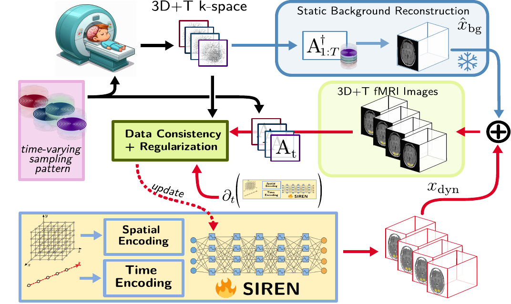

# DD-INR

Dynamics-Driven Implicit Neural Representation for accelerated whole-brain fMRI reconstruction.

Qiaoxin Li, Caini Pan, Pierre-Antoine Comby, Chaithya Giliyar Radhakrishna, Philippe Ciuciu



This repository contains the implementation for the MICCAI 2026 paper **DD-INR: Dynamics-Driven Implicit Neural Representation for Accelerated Whole-Brain functional MRI Reconstruction**. DD-INR reconstructs a dynamic fMRI series as

```text
x(r, t) = x_bg(r) + f_theta(r, t)
```

where `x_bg` is a static background reconstructed from temporally aggregated k-space data, and `f_theta` is a compact SIREN INR dedicated to the dynamic BOLD-related residual.

## Repository Layout

```text
dd_inr/
  data.py          normalized 3D+T coordinate grids and frame-wise DataLoader
  losses.py        k-space loss, TV/l2-gradient losses, warm-up schedules
  models.py        spatial/temporal Fourier features and SIREN model
  nufft.py         MRI-NUFFT autograd wrapper and operator construction
  train.py         DD-INR reconstruction loop
scripts/
  reconstruct_3d.py              command-line reconstruction entry point
examples/
  prepare_snake_simulation.py    SNAKE simulation recipe matching the paper setup
configs/
  dd_inr_simulation.yaml         default MICCAI-style configuration
tests/
  test_smoke.py                  lightweight CPU checks for model/loss/data code
```

## Shape Conventions

- Image volumes use `(X, Y, Z)`.
- Dynamic residual arrays use `(T, X, Y, Z, 2)`, with the last channel storing real and imaginary parts.
- K-space uses `(T, C, N)` after flattening shots.
- Trajectories use `(T, N, 3)` after flattening shots.
- INR coordinates are normalized to `[0, 1]` for space and time.

## Data Format

The reconstruction script expects one directory containing:

```text
kspace.npy      complex array, shape (T, C, shots, samples) or (T, C, samples)
traj.npy        float array, shape (T, shots, samples, 3) or (T, samples, 3)
background.npy  float or complex background volume, shape (X, Y, Z, 2) or (X, Y, Z)
csm.npy         optional coil sensitivity maps for multi-coil MRI-NUFFT
```

The script flattens `shots * samples` automatically. Trajectories should use the coordinate convention expected by MRI-NUFFT for the selected backend.

## Quick Start

```bash
python -m pip install -e .
python scripts/reconstruct_3d.py \
  --config configs/dd_inr_simulation.yaml \
  --data-dir /path/to/prepared_case \
  --case-name MICCAI26_Simulation
```

Outputs are written to `outputs/<case>/<run>/` by default. For large experiments, prefer a symlink:

```bash
ln -s /neurospin/mind/ql284910/HashINR_outputs outputs
```

## Method Defaults

The default configuration follows the paper implementation:

- SIREN with 3 hidden layers and width 512.
- Decoupled Fourier features: `B_xyz in R^(256 x 3)`, `B_t in R^(64 x 1)`.
- Two output channels for real and imaginary dynamic residuals.
- Optional spatial regularization `Rxyz` and spatiotemporal regularization `Rxyz,t`.
- Frame-wise time-varying NUFFT operators using MRI-NUFFT.

## Validation

Run the lightweight checks:

```bash
python -m pytest tests
```


